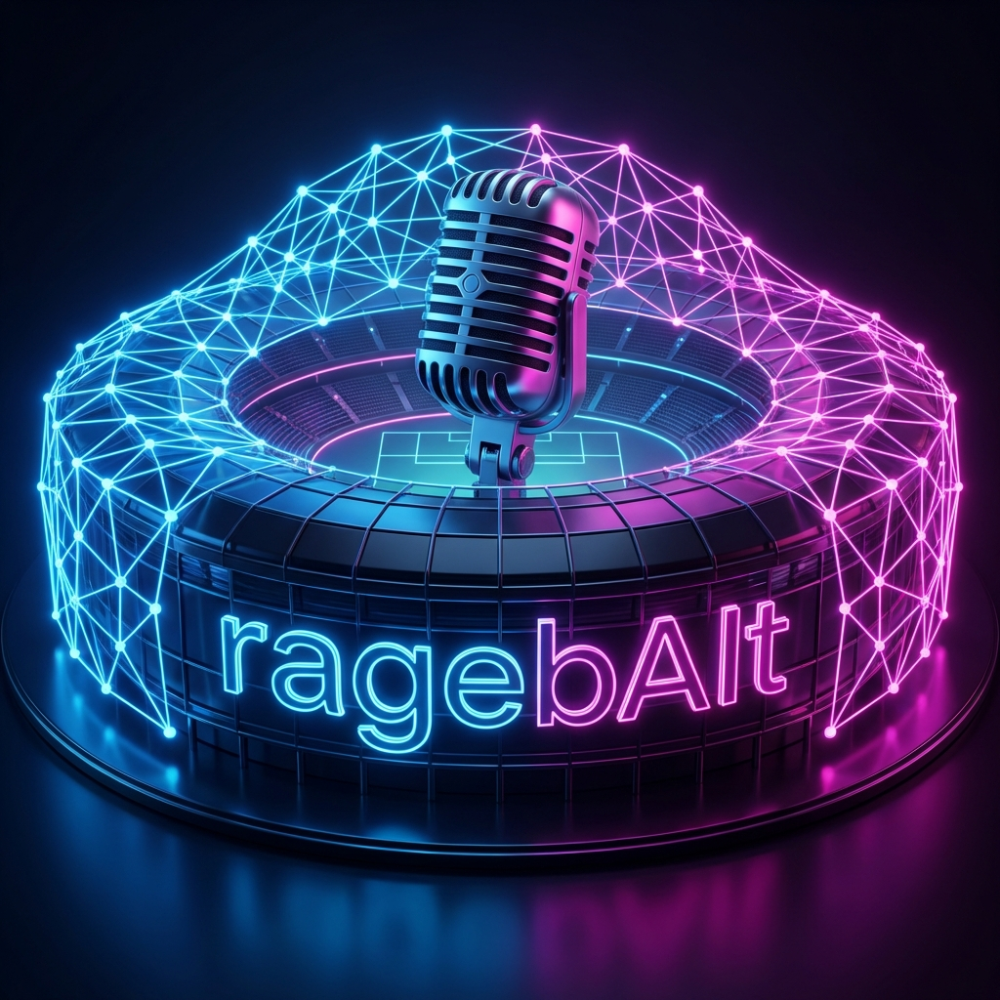

<div align="center">



# 🎬 ragebAIt

**AI Sports Miscommentary Generator - Turn any sports clip into comedy gold.**

[](https://nextjs.org/)
[](https://fastapi.tiangolo.com/)
[](https://fal.ai)
[](https://cerebralvalley.ai/)

[Philosophy](#-why-its-interesting) • [What It Does](#-what-it-does) • [How It Works](#-how-it-works) • [Tech Stack](#️-technologies-used) • [Setup](#-getting-started)

</div>

---

## 📖 About ragebAIt

**ragebAIt** is an AI system that takes real sports broadcast clips and confidently explains them in the most hilariously wrong way possible. It reinterprets serious sports moments through absurd but internally consistent narrative lenses to generate parody videos, memes, and rage-bait content designed to be highly shareable.

## 🎙️ What It Does

1. **Clip Analysis**: Takes a short sports clip as input.
2. **Multimodal Understanding**: Uses advanced video analysis to understand what is actually happening in the scene.
3. **Creative Mis-narration**: Intentionally re-narrates the clip through a wrong but consistent lens.
4. **Content Generation**: Produces parody commentary, captions, and meme-style narratives.
5. **Distribution**: Produces a parody video and optionally posts it to social platforms via automated agents.

> [!NOTE]
> The humor works because the AI first understands the play correctly before deliberately getting it wrong.

## 🤔 Why It’s Interesting

Most sports AI tools aim to be accurate and analytical. **ragebAIt** flips that idea by using strong understanding to produce **creative misinterpretation**. This makes the output funny, believable, and emotionally engaging, especially for live sports fans.

---

## 🛠️ Technologies Used

- **Gemini 3**: For state-of-the-art multimodal video understanding and parody commentary generation.
- **fal.ai**: For high-fidelity parody video generation (Minimax/Kling models).
- **Nano Banana**: For instant sports meme generation.
- **Browser Use**: For automated social media posting (e.g., Twitter/X).
- **Antigravity**: For rapid agent-based development, code generation, and testing.
- **Next.js & FastAPI**: Powering the modern full-stack web interface.
- **Vercel**: For seamless hosting and deployment.

---

## 🏆 Hackathon Details

This project was built entirely during the **Cerebral Valley x Google DeepMind Gemini 3 Super Hackathon**. All code in this repository is open source and was written from scratch during the event.

---

## 🚀 Getting Started

### Prerequisites

- Python 3.10+
- Node.js 18+
- API Keys: `GEMINI_API_KEY`, `FAL_KEY`

### Setup

1. **Clone the repository**
   ```bash
   git clone https://github.com/vatsalajha/ragebAIt.git
   cd ragebAIt
   ```

2. **Backend Setup**
   ```bash
   cd backend
   python -m venv venv
   source venv/bin/activate # or venv\Scripts\activate on Windows
   pip install -r requirements.txt
   cp .env.example .env # Add your keys here
   python main.py
   ```

3. **Frontend Setup**
   ```bash
   cd frontend
   npm install
   npm run dev
   ```

---

<div align="center">
Built with 🔥 at Cerebral Valley
</div>
